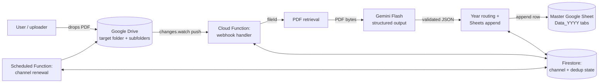
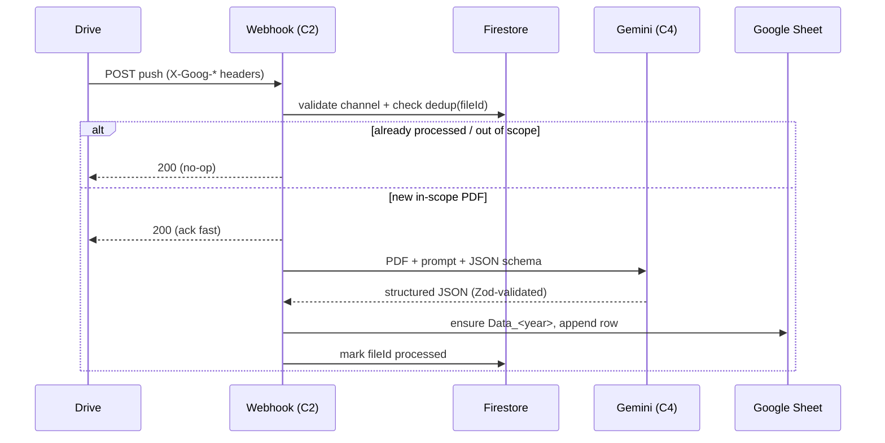

# High-Level Design (HLD) — Shuddhi-Moolam

This is the system-level design for the PDF→Sheets extraction pipeline. It sits
above the individual backlog tickets (`planning/backlog/`) and the decision
record (`knowledge/adr/001-event-driven-architecture.md`), and below the exact
field contract (`knowledge/domain_model.md`). Read those for the "why" and the
"what exactly"; this doc is the "how it fits together".

## 1. Purpose & scope

**In scope:** automatically extracting a fixed set of commodity prices from
weekly PDF newsletters that land in Google Drive, and appending one row per
issue to a year-partitioned master Google Sheet, with no human in the loop.

**Out of scope (for now):** a UI, historical backfill of old PDFs, multi-tenant
support, and analytics on the extracted data. These are potential future work,
not part of the core pipeline.

## 2. System context

## 3. Components

| # | Component | Responsibility | Ticket |
|---|---|---|---|
| C1 | **Drive watch registrar + renewer** | Register a `changes.watch` channel on the target folder tree; a scheduled function renews it before the ~7-day expiry. Channel state in Firestore. | SM-02 |
| C2 | **Webhook handler** | Receive Drive push POST, validate `X-Goog-*` headers, resolve changed `fileId`(s), filter to the target folder tree, dedup against Firestore, and kick off processing. Returns a fast 200. | SM-03 |
| C3 | **PDF retrieval** | Fetch the PDF bytes (or Drive URI) for a `fileId` via the service account. | SM-04 |
| C4 | **Extraction engine** | Call Gemini Flash with the PDF + prompt + structured-output schema; validate with Zod; retry/backoff; log cost. | SM-05 |
| C5 | **Router + appender** | Parse the year, ensure `Data_<year>` exists (create with headers if not), map the record to a row, append idempotently. | SM-06, SM-07 |
| C6 | **Observability + resilience** | Structured logging with a `fileId` correlation id, failure alerting, dead-letter + reprocess, cost tracking. | SM-08 |
| — | **State store (Firestore)** | Drive channel state (`channelId`, `resourceId`, expiry) and a processed-file dedup store. | SM-02, SM-03 |

## 4. End-to-end flow

The webhook acknowledges Drive quickly and does the heavy work (download →
Gemini → Sheets) after the ack, so Drive doesn't retry on a slow response.

## 5. Data design

- **Extraction record:** the 13-field flat object in
  `knowledge/domain_model.md` (prices as strings to preserve ranges verbatim).
- **Sheet layout:** one tab per year (`Data_<year>`); column order is a shared
  contract between the schema, the tab headers (SM-06), and the row mapper
  (SM-07).
- **Firestore:**
  - `drive_channels/{channelId}` → `{ resourceId, expiration, folderId }`
  - `processed_files/{fileId}` → `{ status, issueDate, processedAt, error? }`

## 6. Cross-cutting concerns

- **Idempotency:** keyed on `fileId` and `newsletter_issue_date`; a Drive
  re-notification or a renewal-triggered replay must not append a duplicate row.
- **Security & identity:** runs as a dedicated service account with least
  privilege — Editor only on the target Drive folder and the master Sheet.
  Secrets (`GEMINI_API_KEY`, SA key) live in Functions config / secrets, never
  in code. See `knowledge/infrastructure.md`.
- **Reliability:** Gemini calls retry with backoff; Zod-validation failure is a
  hard stop (dead-letter + alert), never a partial write. Drive channels are
  renewed on a schedule so notifications don't silently stop.
- **Cost:** Gemini Flash + serverless scale-to-zero keep idle cost near zero at
  the ~1-file/week volume; token usage is logged per file (SM-08).
- **Observability:** one correlation id (`fileId`) threads logs across all
  stages; failures alert a human channel.

## 7. Deployment view

`dev → staging → main` branches map to Firebase environments (topology TBD —
see `knowledge/infrastructure.md` Known Gaps). Cloud Functions deploy via CI on
push (SM-09). Docs (this file included) sync to the shared docs portal.

## 8. Key risks & mitigations

| Risk | Mitigation |
|---|---|
| Drive push channel expires unnoticed | Scheduled renewal function + alert on stale channel (SM-02, SM-08) |
| Gemini returns malformed / partial data | Structured-output schema + Zod validation → dead-letter, no partial write (SM-05) |
| Duplicate rows from re-notifications | Firestore dedup keyed on fileId + issue date (SM-03, SM-07) |
| Source PDF layout changes | AI extraction (not templates) absorbs layout drift; prompt tuning isolated to SM-05 |
| Unpinned/misconfigured infra | Prerequisites + gaps tracked explicitly in `infrastructure.md` |

## 9. Related documents

- Decision rationale: `knowledge/adr/001-event-driven-architecture.md`
- Exact field contract: `knowledge/domain_model.md`
- Infra, secrets, gaps: `knowledge/infrastructure.md`
- Delivery plan: `planning/backlog/` (SM-01 … SM-10)
